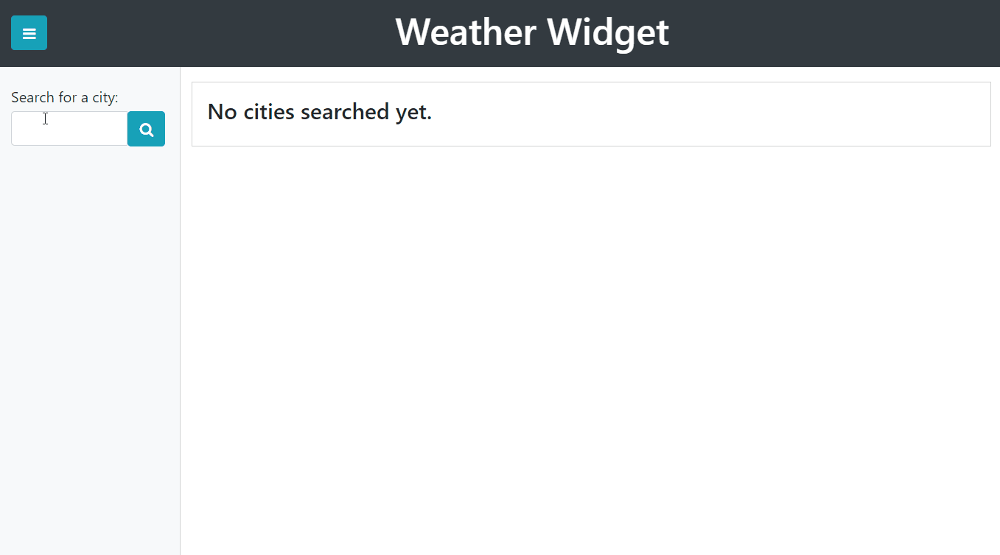

# Weather Widget
Sixth homework assignment for uw-sea-fsf-pt-08-2020-u-c, [a weather dashboard using the OpenWeather API.](https://github.com/ziieng/WeatherWidget)

## Table of Contents

* [Description](#description)
  * [OpenWeather Queries](#openweather-queries)
  * [Displaying the Results](#displaying-the-results)
  * [Managing the List](#managing-the-list)
* [Built With](#built-with)
* [Future Changes](#future-changes)
* [Contact](#contact)

## Description 
For this assignment, we were tasked with creating a weather dashboard that would allow users to quickly access the current and future weather conditions for a number of cities. The list of cities to be used is also provided by the user, so it begins with a blank list and adds each individually as the user requests them. The list is also saved in localStorage, along with some key details needed for the [OpenWeather API](https://openweathermap.org/api), so it persists across multiple sessions.

### OpenWeather Queries
OpenWeather offers 20 different API's, and we were tasked with figuring out which to use. For this assignment, I used two: [Current Weather Data](https://openweathermap.org/current) and [One Call API](https://openweathermap.org/api/one-call-api). 

The dashboard's given interface prompts users for a city name, but the only OpenWearther API that uses city names as an available query is the Current Weather. All other API's (including One Call) require the latitude and longitude co-ordinates of your requested location. To resolve this disconnect, I set up my app to take the city name provided and make a [Current Weather](https://openweathermap.org/current) call with it to retrieve the co-ordinates needed. This also served as a way to validate the city name entered and obtain a string of it with proper capitalization already in place. These three pieces of information (name, latitude, and longitude) were then stored as an object within a 'cityList' array, and saved into localStorage. I used javascript to refresh the city buttons in my dashboard's sidebar and "click" the button for the new city.

When a city is clicked, then a second call is made to OpenWeather through the [One Call API](https://openweathermap.org/api/one-call-api). This is a newer API, designed to compile all the most commonly needed pieces into one: current weather (including UV Index), minutely data, hourly data, daily data, and government weather alerts. It also offers the ability to specify which units of measurement to display, and which segments of data to exclude. To speed up the response to my call, it excludes the minutely and hourly sections that I have no use for. To make displaying results simpler, I also set up the call to return imperial units - Fahrenheit for temperature, and miles per hour for wind speed.

### Displaying the Results
When the One Call API response comes in, javascript writes the relevant pieces of data to the page in HTML elements styled to follow what the assignment laid out. The assignment asks for the current temperature, humidity, wind speed, and UV index; and for the forecast for the next 5 days. The current data is displayed in one larger section that fills the width of the screen, and the 5-day forecast is written to cards that float beneath it. 

OpenWeather provides icons to show general weather conditions, which are also referenced in their API response data. I set up my app to use those icons to decorate the current and forecasted weather, and provide an easy way to see expected conditions at a glance. The forecast cards are created with a loop that iterates through the daily data and writes the date referenced, high and low temperatures, and humidity for each day.

The current weather's UV Index is assigned a color using Bootstrap's "badge" classes to show whether the conditions are favorable, moderate, or severe. I based these classifications off [a chart of how to inerpret UV index data](https://wp02-media.cdn.ihealthspot.com/wp-content/uploads/sites/200/2018/08/03014643/UV-Index.png) found through Google; under 3 is considered favorable, higher than 3 but less than 8 is considered moderate, and 8 or over is considered severe. 

### Managing the List
For our assignment, we were only required to have a persistent array of cities to use after each page refresh. However, that minimum requirement didn't feel like enough to have an intuitive user experience. I added in another local storage item to save the index of the last city requested, so when the user refreshes the page they are presented with refreshed data for the same location. The default behavior of the assignment was to show the last city in the list, even if the user clicked on an earlier one before refreshing the page.

I also added a way to remove cities from the list, in case the user entered an incorrect city or no longer needed information on one. When they click on the trashcan icon at the end of a city button, it is removed from the city array and the sidebar buttons are re-created. This made it so the stored data index on each button didn't have to be dynamically updated, but instead I had to adjust the saved city index in case of it exceeding the length of the city array, or being the city removed. After a bit of testing, I'm confident in the stability of this feature.

## Future Changes
With my current skillset, I don't have the tools necessary to avoid posting an API key directly to my GitHub repo. Once I have gained those skills, I would like to update this project to scrub my API key (and possibly disable this key) to prevent future misuse. For OpenWeather, the possible damage is minimal since they don't charge for queries made through the free account keys. At worst, if too many calls are made through it the key might eventually be disabled.

While the prompt for this assignment only makes use of city names for the search query, I would like to update this when I have more time so it also takes state or country inputs so users can specify *which* Portland or Paris they want to see. It may be easier to achieve this by using another API like Google Maps to find the right country or state codes to pass along to the OpenWeather query.

## Built With

* [OpenWeather API](https://openweathermap.org/api)
* jQuery
* JavaScript
* Bootstrap
* CSS
* HTML

## Contact

Zii (Christina) Engelhardt - cjengelhardt@gmail.com

Project Link: [https://ziieng.github.io/WeatherWidget/](https://ziieng.github.io/WeatherWidget/)

Repository Link: [https://github.com/ziieng/WeatherWidget](https://github.com/ziieng/WeatherWidget)

[1]:<https://ziieng.github.io/WeatherWidget/>